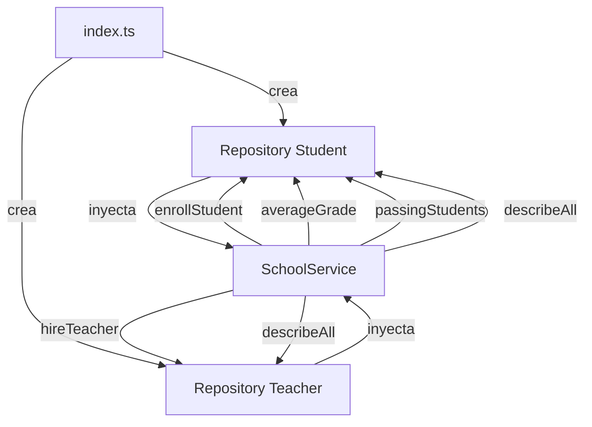

# Diagrama UML/ERD del Proyecto School-TS

## 📋 Descripción General

Este documento explica el diagrama UML (Unified Modeling Language) del proyecto School-TS, que modela un sistema de gestión escolar orientado a objetos usando TypeScript.

---

## 🏗️ Arquitectura del Sistema

El proyecto está organizado en **3 capas principales**:

1. **Capa de Modelos** (`models/`)
   - Person (abstracta)
   - Student
   - Teacher

2. **Capa de Datos** (`repository/`)
   - Repository<T> (genérico)

3. **Capa de Servicios** (`services/`)
   - SchoolService

---

## 🎯 Entidades y Clases

### 1️⃣ Person (Clase Abstracta Base)

```typescript
abstract class Person {
    + id: number
    # name: string
    
    + Person(id: number, name: string)
    + getName(): string
    + setName(newName: string): void
    {abstract} + describe(): string
}
```

**Características:**
- ⚠️ **Clase abstracta**: No se puede instanciar directamente
- 🔑 Define la estructura base para todas las personas
- 📝 Propiedades:
  - `id` (public): Identificador único
  - `name` (protected): Nombre de la persona
- 🔧 Método abstracto `describe()`: Debe ser implementado por las clases hijas

**Propósito:** Evitar duplicación de código y garantizar que todas las personas tengan id y name.

---

### 2️⃣ Student (Estudiante)

```typescript
class Student extends Person {
    + grade: number
    
    + Student(id: number, name: string, grade: number)
    + describe(): string
    + isPassing(): boolean
}
```

**Características:**
- 🎓 Hereda de `Person`
- 📊 Propiedad adicional: `grade` (calificación)
- ✅ Implementa `describe()` con formato específico para estudiantes
- 🎯 Método `isPassing()`: Verifica si aprueba (nota >= 6)

**Ejemplo de uso:**
```typescript
const student = new Student(1, "Ana Pérez", 8);
console.log(student.describe()); 
// → "Estudiante: Ana Pérez (ID: 1) - Nota: 8"
console.log(student.isPassing()); 
// → true
```

---

### 3️⃣ Teacher (Profesor)

```typescript
class Teacher extends Person {
    - subject: string
    
    + Teacher(id: number, name: string, subject: string)
    + describe(): string
    + getSubject(): string
}
```

**Características:**
- 👨‍🏫 Hereda de `Person`
- 📚 Propiedad adicional: `subject` (materia que enseña)
- ✅ Implementa `describe()` con formato específico para profesores
- 🔍 Método `getSubject()`: Retorna la materia

**Ejemplo de uso:**
```typescript
const teacher = new Teacher(101, "Dr. Ramírez", "Matemáticas");
console.log(teacher.describe()); 
// → "Profesor: Dr. Ramírez (ID: 101) - Materia: Matemáticas"
console.log(teacher.getSubject()); 
// → "Matemáticas"
```

---

### 4️⃣ Repository<T> (Repositorio Genérico)

```typescript
class Repository<T extends { id: number }> {
    - items: T[]
    
    + add(item: T): void
    + getById(id: number): T | undefined
    + getAll(): T[]
    + removeById(id: number): boolean
}
```

**Características:**
- 🔄 **Genérico**: Funciona con cualquier tipo que tenga `id: number`
- 💾 Implementa patrón **Repository** para gestión de datos
- 🛠️ Operaciones CRUD:
  - **Create**: `add(item)`
  - **Read**: `getById(id)`, `getAll()`
  - **Delete**: `removeById(id)`
- ✅ Validación: No permite IDs duplicados

**Ejemplo de uso:**
```typescript
const studentRepo = new Repository<Student>();
studentRepo.add(new Student(1, "Ana", 8));
studentRepo.add(new Student(2, "Carlos", 5));

const student = studentRepo.getById(1);
const allStudents = studentRepo.getAll();
```

---

### 5️⃣ SchoolService (Servicio Escolar)

```typescript
class SchoolService {
    - studentRepo: Repository<Student>
    - teacherRepo: Repository<Teacher>
    
    + SchoolService(studentRepo, teacherRepo)
    + enrollStudent(student: Student): void
    + averageGrade(): number
    + passingStudents(): Student[]
    + hireTeacher(teacher: Teacher): void
    + describeAll(): string[]
}
```

**Características:**
- 🎯 Capa de **lógica de negocio**
- 🔗 **Composición**: Contiene dos repositorios
- 💉 **Inyección de dependencias**: Recibe repositorios en el constructor
- 📊 Métodos de negocio:
  - `enrollStudent()`: Inscribe estudiantes
  - `hireTeacher()`: Contrata profesores
  - `averageGrade()`: Calcula promedio de calificaciones
  - `passingStudents()`: Filtra estudiantes aprobados
  - `describeAll()`: Obtiene descripciones de todos

**Ejemplo de uso:**
```typescript
const studentRepo = new Repository<Student>();
const teacherRepo = new Repository<Teacher>();
const school = new SchoolService(studentRepo, teacherRepo);

school.enrollStudent(new Student(1, "Ana", 8));
school.hireTeacher(new Teacher(101, "Dr. Ramírez", "Matemáticas"));

console.log(school.averageGrade()); // → 8
console.log(school.passingStudents()); // → [Student(1, "Ana", 8)]
```

---

## 🔗 Tipos de Relaciones

### 1. Herencia (Inheritance) - `<|--`

```
Person <|-- Student
Person <|-- Teacher
```

- 📚 **Concepto**: "es un/a" (is-a relationship)
- 🎓 Student **es una** Person
- 👨‍🏫 Teacher **es una** Person
- ✅ Student y Teacher heredan `id`, `name`, `getName()`, `setName()`
- ⚠️ Deben implementar el método abstracto `describe()`

### 2. Composición (Composition) - `*--`

```
SchoolService *-- Repository<Student>
SchoolService *-- Repository<Teacher>
```

- 📦 **Concepto**: "tiene un/a" (has-a relationship)
- 🏫 SchoolService **contiene** Repository<Student>
- 🏫 SchoolService **contiene** Repository<Teacher>
- 🔒 Fuerte acoplamiento: Los repositorios pertenecen al servicio

### 3. Dependencia (Dependency) - `.>`

```
Repository .> Student
Repository .> Teacher
```

- 🔄 **Concepto**: "usa" (uses)
- 💾 Repository **puede almacenar** Student
- 💾 Repository **puede almacenar** Teacher
- 📝 Débil acoplamiento: Solo usa estos tipos, no los posee

---

## 📊 Patrones de Diseño Aplicados

### 1. 🎨 Repository Pattern

**Propósito:** Separar la lógica de acceso a datos del resto de la aplicación.

**Beneficios:**
- ✅ Centraliza operaciones CRUD
- ✅ Fácil de testear (usar mock repositories)
- ✅ Reutilizable para diferentes entidades

### 2. 🏗️ Service Layer Pattern

**Propósito:** Encapsular lógica de negocio compleja.

**Beneficios:**
- ✅ Coordina múltiples repositorios
- ✅ Implementa reglas de negocio
- ✅ API clara para el resto de la aplicación

### 3. 💉 Dependency Injection

**Propósito:** Desacoplar la creación de dependencias.

**Beneficios:**
- ✅ Flexibilidad (cambiar implementaciones fácilmente)
- ✅ Testabilidad (inyectar mocks en tests)
- ✅ Control de dependencias desde fuera

### 4. 🔄 Generic Programming

**Propósito:** Crear componentes reutilizables con seguridad de tipos.

**Beneficios:**
- ✅ Un solo Repository funciona para múltiples tipos
- ✅ TypeScript garantiza seguridad de tipos
- ✅ Reduce duplicación de código

---

## 🎯 Conceptos de POO Aplicados

### 1. Encapsulación 🔒

- **Private** (`-`): `subject` en Teacher, `items` en Repository
- **Protected** (`#`): `name` en Person
- **Public** (`+`): `id`, métodos públicos

**Beneficio:** Control sobre cómo se accede y modifica los datos.

### 2. Herencia 📚

- Person → Student
- Person → Teacher

**Beneficio:** Reutilización de código y estructura común.

### 3. Polimorfismo 🎭

- Múltiples implementaciones de `describe()`:
  - Student retorna formato de estudiante
  - Teacher retorna formato de profesor

**Beneficio:** Diferentes comportamientos con la misma interfaz.

### 4. Abstracción 🎨

- Clase abstracta `Person`
- Método abstracto `describe()`

**Beneficio:** Define contrato que las clases hijas deben cumplir.

---

## 📝 Modificadores de Acceso

| Símbolo | Modificador | Accesible desde |
|---------|-------------|-----------------|
| `+` | public | Cualquier lugar |
| `#` | protected | Clase actual y clases hijas |
| `-` | private | Solo dentro de la clase |

---

## 🚀 Cómo Visualizar el Diagrama

### Opción 1: PlantUML Online
1. Ve a [PlantUML Online Editor](http://www.plantuml.com/plantuml/uml/)
2. Copia el contenido de `diagrama-uml.puml`
3. Pégalo en el editor
4. ✅ Ver diagrama generado

### Opción 2: VS Code Extension
1. Instala la extensión "PlantUML" en VS Code
2. Abre `diagrama-uml.puml`
3. Presiona `Alt + D` para vista previa
4. ✅ Ver diagrama en tiempo real

### Opción 3: Línea de Comandos
```bash
# Instalar PlantUML
brew install plantuml  # macOS
# o
sudo apt install plantuml  # Linux

# Generar imagen
plantuml diagrama-uml.puml

# Se generará: diagrama-uml.png
```

---

## 💡 Flujo de Datos



---

## 📋 Checklist de Conceptos Clave

- ✅ Clase abstracta (Person)
- ✅ Herencia (Student extends Person, Teacher extends Person)
- ✅ Polimorfismo (describe() implementado diferente en cada clase)
- ✅ Encapsulación (private, protected, public)
- ✅ Tipos genéricos (Repository<T>)
- ✅ Inyección de dependencias (SchoolService constructor)
- ✅ Repository pattern
- ✅ Service layer pattern
- ✅ Métodos abstractos
- ✅ Template literals
- ✅ Arrow functions
- ✅ Array methods (filter, reduce, find, some)

---

## 🎓 Resumen

Este proyecto School-TS es un excelente ejemplo de:
- 🏗️ **Arquitectura en capas** (Modelos → Repositorios → Servicios)
- 🎯 **Patrones de diseño** (Repository, Service Layer, Dependency Injection)
- 📚 **Principios de POO** (Encapsulación, Herencia, Polimorfismo, Abstracción)
- 🔧 **TypeScript avanzado** (Genéricos, tipos, interfaces)

---

## 📚 Referencias

- [PlantUML Class Diagrams](https://plantuml.com/class-diagram)
- [TypeScript Handbook](https://www.typescriptlang.org/docs/handbook/intro.html)
- [Repository Pattern](https://martinfowler.com/eaaCatalog/repository.html)
- [Service Layer Pattern](https://martinfowler.com/eaaCatalog/serviceLayer.html)
