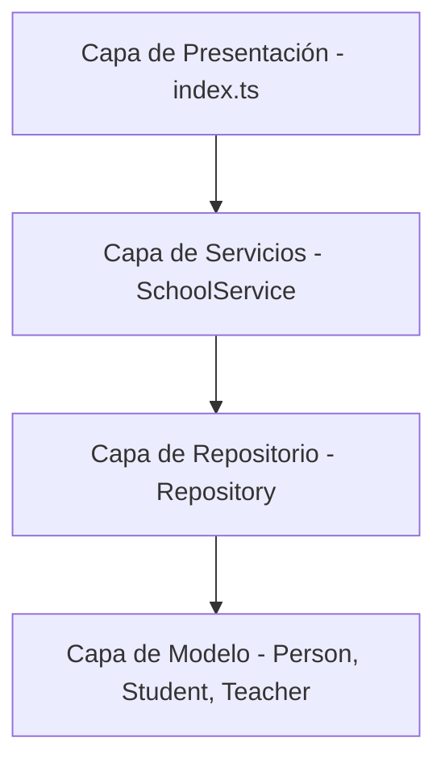
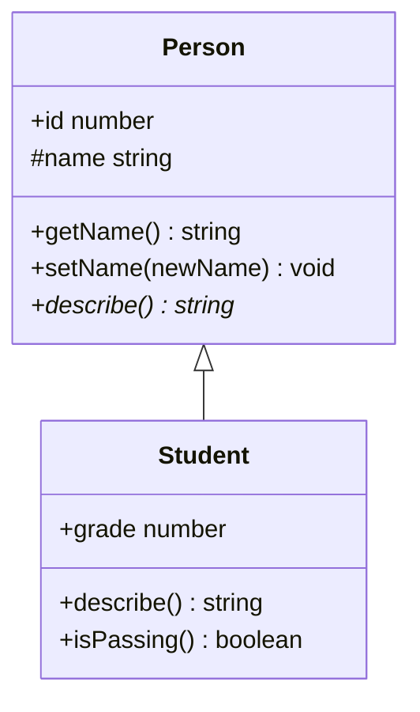
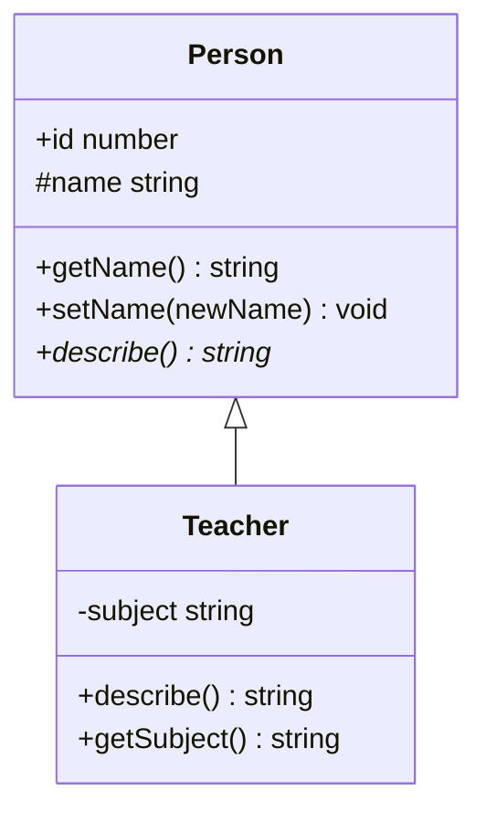
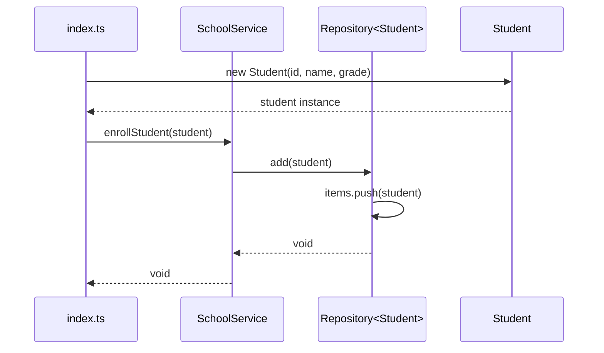
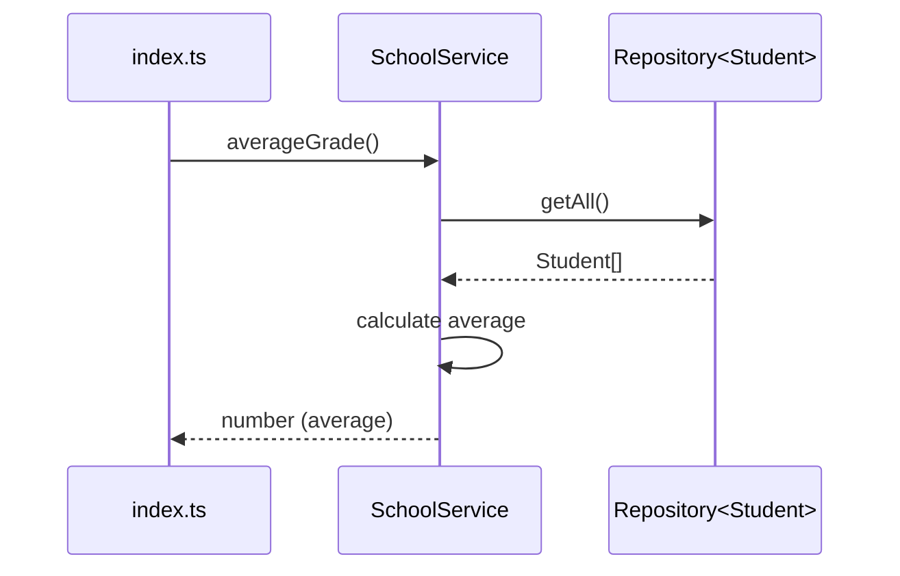

# Explicación Detallada del Diagrama UML - School-TS

## Introducción

Este documento proporciona una explicación completa del diagrama de clases UML para el proyecto **School-TS**, un sistema de gestión escolar desarrollado en TypeScript que implementa principios fundamentales de Programación Orientada a Objetos (POO).

El sistema está diseñado para gestionar estudiantes y profesores mediante un repositorio genérico y servicios especializados, demostrando conceptos clave como herencia, abstracción, encapsulamiento, polimorfismo y genéricos.

---

## Visión General de la Arquitectura

El proyecto sigue una **arquitectura en capas** que separa claramente las responsabilidades:



### Capas del Sistema

1. **Capa de Modelo (Domain Layer)**: Define las entidades del dominio
2. **Capa de Repositorio (Data Access Layer)**: Gestiona el acceso y almacenamiento de datos
3. **Capa de Servicios (Business Logic Layer)**: Implementa la lógica de negocio
4. **Capa de Presentación (Application Layer)**: Punto de entrada y orquestación

---

## Entidades del Dominio

### 1. Person (Clase Abstracta)

#### Descripción
`Person` es una **clase abstracta** que representa la estructura base para todas las personas en el sistema. Al ser abstracta, no puede ser instanciada directamente, sino que sirve como plantilla para clases derivadas.

#### Propiedades

| Propiedad | Tipo | Visibilidad | Descripción |
|-----------|------|-------------|-------------|
| `id` | `number` | `public` | Identificador único de la persona |
| `name` | `string` | `protected` | Nombre de la persona (accesible solo en la clase y sus herederas) |

#### Métodos

| Método | Tipo de Retorno | Visibilidad | Descripción |
|--------|-----------------|-------------|-------------|
| `Person(id, name)` | Constructor | `public` | Inicializa una nueva instancia |
| `getName()` | `string` | `public` | Obtiene el nombre de la persona |
| `setName(newName)` | `void` | `public` | Modifica el nombre de la persona |
| `describe()` | `string` | `public` `abstract` | Método abstracto que debe ser implementado por las clases hijas |

#### Principios POO Aplicados

- **Abstracción**: La clase no puede ser instanciada directamente
- **Encapsulamiento**: La propiedad `name` es protegida, accesible solo mediante getters/setters
- **Polimorfismo**: El método `describe()` es abstracto, permitiendo diferentes implementaciones en las clases derivadas

---

### 2. Student (Estudiante)

#### Descripción
`Student` representa un estudiante en el sistema. Hereda de `Person` y añade funcionalidad específica relacionada con calificaciones académicas.

#### Propiedades Adicionales

| Propiedad | Tipo | Visibilidad | Descripción |
|-----------|------|-------------|-------------|
| `grade` | `number` | `public` | Calificación del estudiante (0-100) |

#### Métodos

| Método | Tipo de Retorno | Visibilidad | Descripción |
|--------|-----------------|-------------|-------------|
| `Student(id, name, grade)` | Constructor | `public` | Inicializa un estudiante con id, nombre y calificación |
| `describe()` | `string` | `public` | Implementación concreta del método abstracto de Person |
| `isPassing()` | `boolean` | `public` | Determina si el estudiante está aprobado (grade >= 60) |

#### Relación de Herencia



#### Ejemplo de Uso

```typescript
const student = new Student(1, "Juan Pérez", 85);
console.log(student.describe()); // "Student(1): Juan Pérez, Grade: 85"
console.log(student.isPassing()); // true
```

---

### 3. Teacher (Profesor)

#### Descripción
`Teacher` representa un profesor en el sistema. Hereda de `Person` y añade funcionalidad específica relacionada con la materia que enseña.

#### Propiedades Adicionales

| Propiedad | Tipo | Visibilidad | Descripción |
|-----------|------|-------------|-------------|
| `subject` | `string` | `private` | Materia que enseña el profesor |

#### Métodos

| Método | Tipo de Retorno | Visibilidad | Descripción |
|--------|-----------------|-------------|-------------|
| `Teacher(id, name, subject)` | Constructor | `public` | Inicializa un profesor con id, nombre y materia |
| `describe()` | `string` | `public` | Implementación concreta del método abstracto de Person |
| `getSubject()` | `string` | `public` | Obtiene la materia que enseña (único acceso a la propiedad privada) |

#### Relación de Herencia



#### Ejemplo de Uso

```typescript
const teacher = new Teacher(1, "María González", "Matemáticas");
console.log(teacher.describe()); // "Teacher(1): María González teaches Matemáticas"
console.log(teacher.getSubject()); // "Matemáticas"
```

---

## Capa de Acceso a Datos

### Repository<T> (Repositorio Genérico)

#### Descripción
`Repository<T>` es una **clase genérica** que implementa el patrón Repository para gestionar colecciones de datos. Proporciona operaciones CRUD (Create, Read, Update, Delete) de forma tipo-segura.

#### Genéricos en TypeScript

El parámetro genérico `T` tiene una **restricción de tipo**:

```typescript
T extends { id: number }
```

Esto significa que cualquier tipo usado con `Repository` **debe** tener una propiedad `id` de tipo `number`.

#### Propiedades

| Propiedad | Tipo | Visibilidad | Descripción |
|-----------|------|-------------|-------------|
| `items` | `T[]` | `private` | Array que almacena los elementos del repositorio |

#### Métodos CRUD

| Método | Tipo de Retorno | Descripción |
|--------|-----------------|-------------|
| `add(item: T)` | `void` | **Create**: Añade un nuevo elemento al repositorio |
| `getById(id: number)` | `T \| undefined` | **Read**: Busca un elemento por su ID |
| `getAll()` | `T[]` | **Read**: Obtiene todos los elementos |
| `removeById(id: number)` | `boolean` | **Delete**: Elimina un elemento por su ID |

#### Patrón Repository

El patrón Repository proporciona:

- **Abstracción**: Separa la lógica de negocio del acceso a datos
- **Reutilización**: El mismo código funciona para diferentes tipos
- **Tipo-Seguridad**: TypeScript verifica en tiempo de compilación que los tipos son correctos
- **Encapsulamiento**: Los datos están protegidos, solo accesibles mediante métodos públicos

#### Ejemplo de Uso

```typescript
// Repositorio de estudiantes
const studentRepo = new Repository<Student>();
studentRepo.add(new Student(1, "Ana García", 90));
studentRepo.add(new Student(2, "Carlos Ruiz", 75));

// Repositorio de profesores
const teacherRepo = new Repository<Teacher>();
teacherRepo.add(new Teacher(1, "Dr. López", "Física"));

// Tipo-seguridad: el compilador verifica los tipos
const student = studentRepo.getById(1); // type: Student | undefined
const allStudents = studentRepo.getAll(); // type: Student[]
```

---

## Capa de Servicios

### SchoolService (Servicio Escolar)

#### Descripción
`SchoolService` es la **capa de servicios** que coordina la lógica de negocio entre múltiples repositorios. Implementa operaciones de alto nivel que combinan funcionalidades de estudiantes y profesores.

#### Propiedades Privadas

| Propiedad | Tipo | Visibilidad | Descripción |
|-----------|------|-------------|-------------|
| `studentRepo` | `Repository<Student>` | `private` | Repositorio de estudiantes |
| `teacherRepo` | `Repository<Teacher>` | `private` | Repositorio de profesores |

#### Inyección de Dependencias

El constructor recibe las dependencias como parámetros:

```typescript
constructor(
  studentRepo: Repository<Student>,
  teacherRepo: Repository<Teacher>
)
```

Este patrón permite:
- **Desacoplamiento**: El servicio no crea sus dependencias
- **Testabilidad**: Fácil de testear con mocks
- **Flexibilidad**: Se pueden cambiar las implementaciones sin modificar el servicio

#### Métodos de Lógica de Negocio

| Método | Tipo de Retorno | Descripción |
|--------|-----------------|-------------|
| `enrollStudent(student: Student)` | `void` | Inscribe un nuevo estudiante en el sistema |
| `averageGrade()` | `number` | Calcula el promedio de todas las calificaciones |
| `passingStudents()` | `Student[]` | Retorna solo los estudiantes que están aprobando |
| `hireTeacher(teacher: Teacher)` | `void` | Contrata un nuevo profesor |
| `describeAll()` | `string[]` | Retorna las descripciones de todos los estudiantes y profesores |

#### Ejemplo de Uso

```typescript
const studentRepo = new Repository<Student>();
const teacherRepo = new Repository<Teacher>();
const schoolService = new SchoolService(studentRepo, teacherRepo);

// Operaciones de negocio
schoolService.enrollStudent(new Student(1, "Pedro Sánchez", 88));
schoolService.enrollStudent(new Student(2, "Laura Martín", 55));
schoolService.hireTeacher(new Teacher(1, "Prof. Rodríguez", "Historia"));

console.log(schoolService.averageGrade()); // 71.5
console.log(schoolService.passingStudents()); // [Student(1): Pedro Sánchez]
console.log(schoolService.describeAll()); 
// [
//   "Student(1): Pedro Sánchez, Grade: 88",
//   "Student(2): Laura Martín, Grade: 55",
//   "Teacher(1): Prof. Rodríguez teaches Historia"
// ]
```

---

## Relaciones entre Clases

### 1. Herencia (Inheritance)

**Símbolo UML**: `<|--` (flecha con triángulo vacío)

```
Person <|-- Student : extends
Person <|-- Teacher : extends
```

#### Características

- `Student` y `Teacher` heredan todas las propiedades y métodos de `Person`
- Ambas clases **deben** implementar el método abstracto `describe()`
- Relación **"es-un"**: Un Student **es-una** Person, un Teacher **es-una** Person

#### Beneficios

- **Reutilización de código**: No se duplica la lógica de `id` y `name`
- **Jerarquía clara**: Estructura lógica del dominio
- **Polimorfismo**: Se puede tratar a Student y Teacher como Person

---

### 2. Composición (Composition)

**Símbolo UML**: `*--` (diamante relleno)

```
SchoolService *-- "1" Repository : studentRepo
SchoolService *-- "1" Repository : teacherRepo
```

#### Características

- `SchoolService` **contiene** instancias de `Repository`
- **Relación fuerte**: Si se destruye `SchoolService`, se destruyen sus repositorios
- **Cardinalidad "1"**: Cada `SchoolService` tiene exactamente **un** repositorio de cada tipo

#### Ciclo de Vida

```typescript
// Creación: los repositorios son creados o inyectados
const service = new SchoolService(studentRepo, teacherRepo);

// Destrucción: cuando service es destruido, también lo son sus repositorios
// (en lenguajes con gestión manual de memoria)
```

---

### 3. Dependencia (Dependency)

**Símbolo UML**: `..>` (flecha punteada)

```
Repository ..> Student : <<uses>>
Repository ..> Teacher : <<uses>>
```

#### Características

- `Repository` **usa** los tipos `Student` y `Teacher` como parámetros genéricos
- **Relación débil**: `Repository` no crea ni posee instancias directamente
- Los métodos de `Repository` trabajan con estos tipos

#### Acoplamiento Débil

```typescript
// Repository no depende de implementaciones específicas
// Funciona con cualquier tipo que cumpla { id: number }
class Repository<T extends { id: number }> {
  // Puede almacenar Student, Teacher, o cualquier otro tipo válido
}
```

---

## Principios de POO Aplicados

### 1. Encapsulamiento

| Clase | Ejemplo | Beneficio |
|-------|---------|-----------|
| `Person` | `name` es `protected` | Solo accesible mediante `getName()` y `setName()` |
| `Teacher` | `subject` es `private` | Solo accesible mediante `getSubject()` |
| `Repository` | `items` es `private` | Solo modificable mediante métodos CRUD |

### 2. Abstracción

```typescript
// No se puede instanciar Person directamente
const person = new Person(1, "Nombre"); // ERROR

// Solo se pueden crear instancias de clases concretas
const student = new Student(1, "Nombre", 80); // OK
const teacher = new Teacher(1, "Nombre", "Materia"); // OK
```

### 3. Herencia

```typescript
// Student y Teacher reutilizan código de Person
class Student extends Person {
  // Hereda: id, name, getName(), setName()
  // Implementa: describe() (método abstracto)
  // Añade: grade, isPassing()
}
```

### 4. Polimorfismo

```typescript
// Array polimórfico: puede contener Student y Teacher
const people: Person[] = [
  new Student(1, "Ana", 90),
  new Teacher(2, "Prof. López", "Matemáticas")
];

// Cada objeto llama a su propia implementación de describe()
people.forEach(p => console.log(p.describe()));
// "Student(1): Ana, Grade: 90"
// "Teacher(2): Prof. López teaches Matemáticas"
```

### 5. Genéricos (Generics)

```typescript
// Un solo código funciona para múltiples tipos
class Repository<T extends { id: number }> {
  private items: T[] = [];
  add(item: T): void { this.items.push(item); }
}

// Instancias especializadas
const studentRepo: Repository<Student> = new Repository<Student>();
const teacherRepo: Repository<Teacher> = new Repository<Teacher>();
```

---

## Patrones de Diseño Implementados

### 1. Repository Pattern

**Propósito**: Centralizar y abstraer el acceso a datos

**Implementación**:
- Clase `Repository<T>` encapsula operaciones CRUD
- `SchoolService` no manipula directamente las colecciones de datos

**Beneficios**:
- Cambiar la implementación de almacenamiento sin afectar la lógica de negocio
- Código más testeable y mantenible

### 2. Dependency Injection

**Propósito**: Reducir acoplamiento entre componentes

**Implementación**:
```typescript
class SchoolService {
  constructor(
    private studentRepo: Repository<Student>,
    private teacherRepo: Repository<Teacher>
  ) {}
}
```

**Beneficios**:
- Facilita testing con mocks
- Mayor flexibilidad y reutilización

### 3. Template Method (Implícito)

**Propósito**: Definir el esqueleto de un algoritmo en la clase base

**Implementación**:
- `Person.describe()` es abstracto
- `Student` y `Teacher` proporcionan implementaciones específicas

**Beneficios**:
- Garantiza que todas las subclases implementen comportamientos esenciales
- Polimorfismo consistente

---

## Diagrama de Flujo de Operaciones

### Flujo de Inscripción de Estudiante



### Flujo de Cálculo de Promedio



---

## Leyenda de Símbolos UML

| Símbolo | Significado | Ejemplo |
|---------|-------------|---------|
| `<\|--` | **Herencia** (extends) | `Person <\|-- Student` |
| `*--` | **Composición** (contiene, ciclo de vida dependiente) | `SchoolService *-- Repository` |
| `..>` | **Dependencia** (usa temporalmente) | `Repository ..> Student` |
| `+` | **Public** (accesible desde cualquier lugar) | `+id: number` |
| `#` | **Protected** (accesible en la clase y subclases) | `#name: string` |
| `-` | **Private** (accesible solo en la clase) | `-subject: string` |
| `{abstract}` | **Método abstracto** (debe ser implementado en subclases) | `{abstract} describe()` |

---

## Estructura de Archivos del Proyecto

```
School-TS/
├── src/
│   ├── models/
│   │   ├── Person.ts        # Clase abstracta base
│   │   ├── Student.ts       # Hereda de Person
│   │   └── Teacher.ts       # Hereda de Person
│   ├── repository/
│   │   └── Repository.ts    # Repositorio genérico
│   ├── services/
│   │   └── SchoolService.ts # Lógica de negocio
│   └── index.ts            # Punto de entrada
├── diagrama-uml.puml       # Diagrama completo con comentarios
├── diagrama-uml-simplificado.puml  # Diagrama sin comentarios
└── EXPLICACION-DIAGRAMA-UML.md     # Este documento
```

---

## Conceptos Avanzados de TypeScript

### 1. Clases Abstractas

```typescript
abstract class Person {
  abstract describe(): string; // Firma sin implementación
}

// ERROR: Cannot create an instance of an abstract class
const p = new Person(1, "Nombre");
```

### 2. Modificadores de Acceso

```typescript
class Example {
  public publicProp: string;      // Accesible desde cualquier lugar
  protected protectedProp: string; // Solo en clase y subclases
  private privateProp: string;     // Solo en la clase
}
```

### 3. Genéricos con Restricciones

```typescript
// T debe tener la propiedad 'id' de tipo number
class Repository<T extends { id: number }> {
  // TypeScript garantiza que T.id existe
  getById(id: number): T | undefined {
    return this.items.find(item => item.id === id);
  }
}
```

### 4. Parámetros de Constructor como Propiedades

```typescript
// Forma abreviada de TypeScript
class SchoolService {
  constructor(
    private studentRepo: Repository<Student>,  // Crea y asigna automáticamente
    private teacherRepo: Repository<Teacher>
  ) {}
}

// Equivalente a:
class SchoolService {
  private studentRepo: Repository<Student>;
  private teacherRepo: Repository<Teacher>;
  
  constructor(studentRepo: Repository<Student>, teacherRepo: Repository<Teacher>) {
    this.studentRepo = studentRepo;
    this.teacherRepo = teacherRepo;
  }
}
```

---

## Conclusión

Este diagrama UML representa una arquitectura bien estructurada que demuestra:

✅ **Separación de responsabilidades** mediante capas claramente definidas  
✅ **Reutilización de código** a través de herencia y genéricos  
✅ **Tipo-seguridad** aprovechando el sistema de tipos de TypeScript  
✅ **Flexibilidad** mediante inyección de dependencias  
✅ **Escalabilidad** con patrones de diseño probados  
✅ **Mantenibilidad** con encapsulamiento y abstracción adecuados  

El diseño permite extender fácilmente el sistema agregando nuevos tipos de personas (por ejemplo, `Administrator`), nuevos repositorios o nuevos servicios sin modificar el código existente, siguiendo el **Principio Open/Closed** de SOLID.

---

## Referencias

- [TypeScript Handbook - Classes](https://www.typescriptlang.org/docs/handbook/2/classes.html)
- [TypeScript Handbook - Generics](https://www.typescriptlang.org/docs/handbook/2/generics.html)
- [UML Class Diagrams](https://www.uml-diagrams.org/class-diagrams-overview.html)
- [Repository Pattern](https://martinfowler.com/eaaCatalog/repository.html)
- [Dependency Injection](https://en.wikipedia.org/wiki/Dependency_injection)
